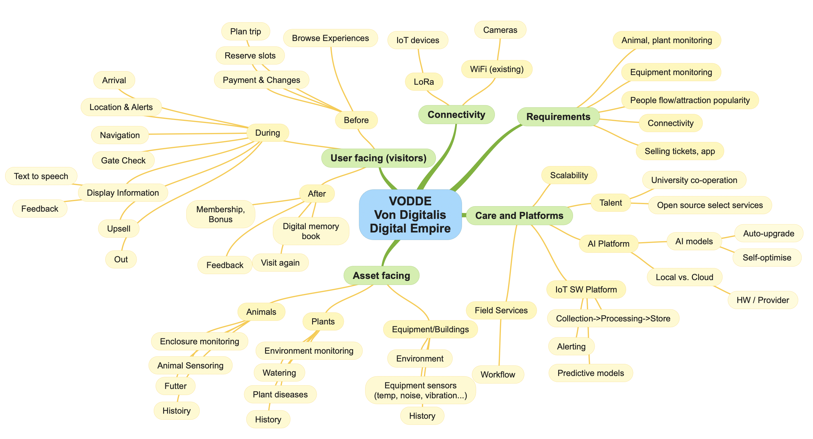
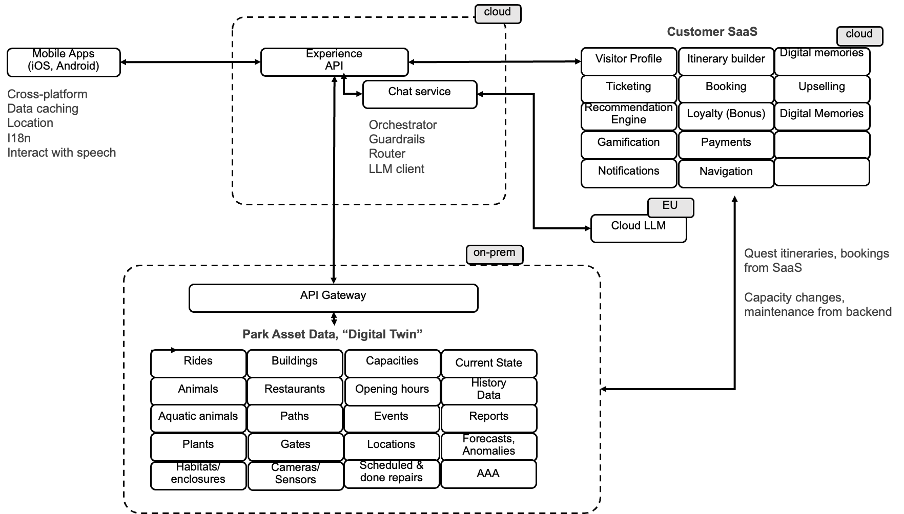
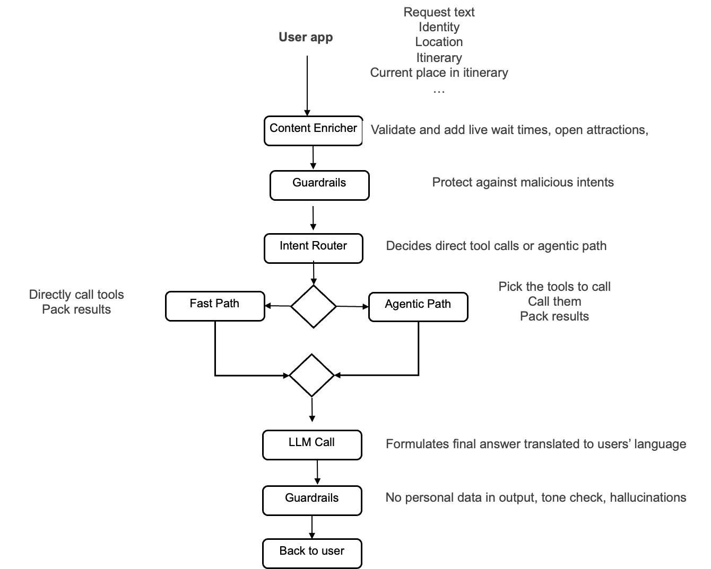
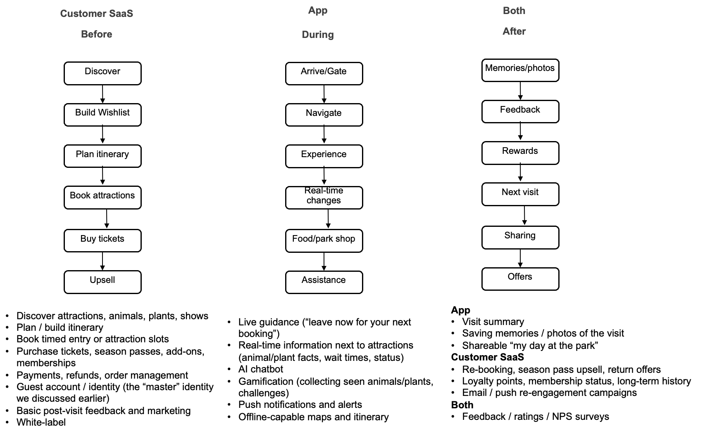
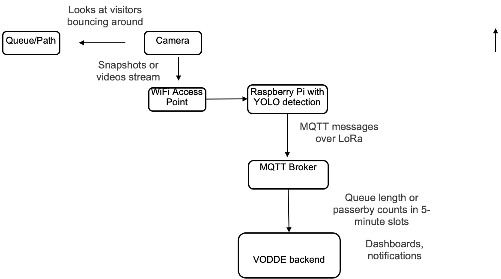
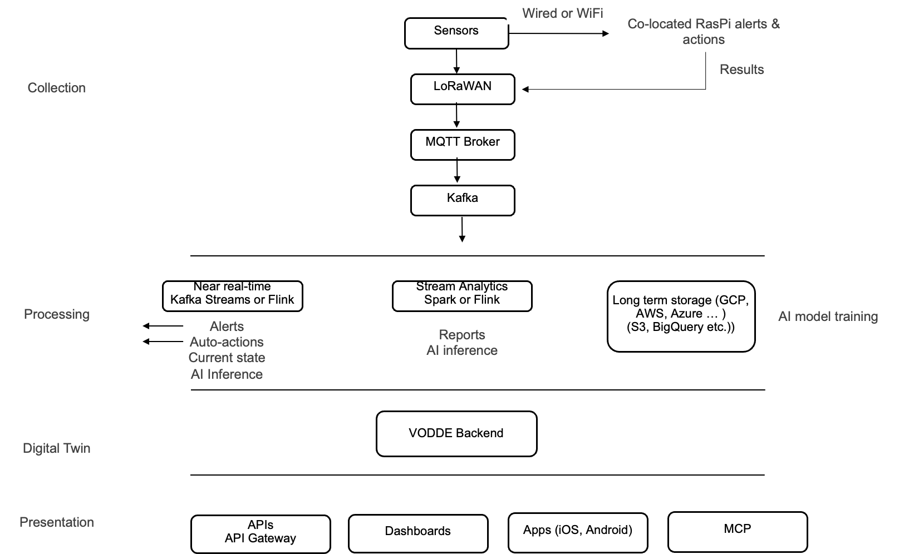
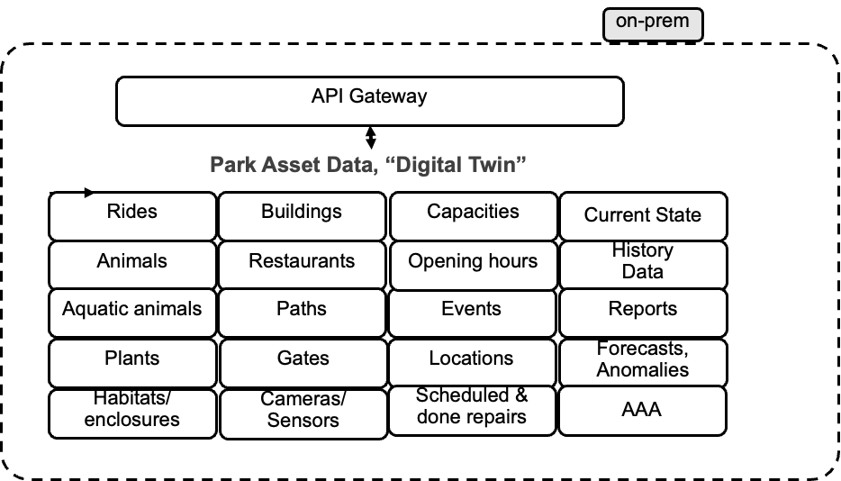
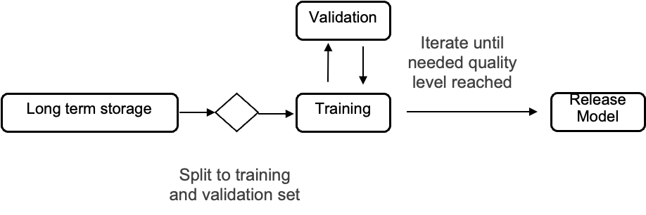

# Introduction

This repo represents quick answer to O’Reilly Architectural Katas 2026: AI-Assisted Software Architecture.

72nd Contess of Von Digitalis has inherited an estate consisting of a
historic amusement park, a collection of poisonous land and aquatic
animals including jumping piranhas and a plant collection to go.
Amusement park has 40 rides, and there are over 200 animals in the
collection split across 55 locations on the site.

Key success criteria is to triple visitors from 5000 a day to 15000 per
day. Needed systems include a way to sell individual and family tickets,
capability to track what attractions draw crowds and ability to monitor
animal and plant wellbeing.

A modern architecture utilizing also AI is thought to bring digital
salvation to the damsel in distress. We are on the job.

## Team
[Martti Ylikoski](https://www.linkedin.com/in/marttiylikoski/)
[Heikki Almay](https://www.linkedin.com/in/heikki-almay/)

## Big picture

The solution can be split many ways, we've decided to look at it three
ways:

- Visitor facing (sales system)

- Asset (equipment, animals, plants) facing (with reports on popularity)

- Care & Enablers: IoT and AI platforms and field services (not
  covered).

Visitor facing parts is split into what the customer can do before
visit, during visit and after it. Asset facing is traditional IoT data
capture, analysis, insights and action.

As a mind-map VonDigitals Digital Enterprise (VODDE) becomes:

Fear not, we cover only on high-level and skip less important aspects.\
Caveat Emptor: lightweight use of AI in getting ideas for use cases and
functionalities for different parts + what to sensor has been used. The
ask was really to focus on AI but in our experience it is suboptimal
(but very popular) to create solutions with wrong or no understanding
what users need, hence focus also on that.

# High-Level Architecture

The two main value-adding domains are the customer facing and asset
facing parts. For deployment architecture we propose a hybrid approach.

- Customer-facing commerce and experience layers are well established
  SaaS products and rebuilding all required functionality (payment
  gateway integrations, DDoS protection etc.) would require an
  investment that is hard to justify.

  - A quick search reveals several potential candidates (attractions.io
    provides white-label mobile app platform with most features, accesso
    seems industry leader, ROLLER software, RocketRez and so on). With
    SaaS software you end up with a fixed blob that has most features
    and then you just learn to live with it. Many SaaS products can be
    customized for a cost but once the platform upgrades, the
    customizations need to be redone in many cases.

- IoT, asset management and operations layers however can be built
  closer to the facility. Functionality here is mostly for managing slow
  changing asset data on one hand and on the other hand reception of IoT
  sensor data via LoRa network into an IoT measurement database and then
  building alerts, reports and predictive models based on it.

  - Keeping this closer to the park brings lower latency for real-time
    guidance, resilience if internet drops, data sovereignty (especially
    on operational data), and ability to iterate quickly on predictive
    models and the differentiating AI features.

Very simply: Customer SaaS is system of record for identity & commerce.
Backend is system of record for assets, IoT state, and operational data

Both areas need some data from each other, meaning integration is
needed. Data to be integrated includes:

- **Asset to Customer**: Scheduled maintenance, closures, capacity
  changes, real-time wait times or zone occupancy, travel-time estimates
  between points, special events or animal activity alerts. These feed
  the itinerary engine and chatbot so the app can proactively nudge
  "leave now to make your next booked slot" or "this animal is active
  right now."

- **Customer to Asset**: Booked itineraries / timed reservations,
  expected arrival windows, group sizes, accessibility needs. Useful for
  staffing, predictive crowding models, and capacity adjustments.

- Shared identity (anonymized where possible) so the app and backend can
  correlate a visitor's plan with real-time conditions without exposing
  unnecessary PII.

Overall architecture looks like the diagram below and we'll cover it in
more details later:

- **Mobile app** is cross-platform self-developed using for example
  typescript and Capacitor. To ensure good customer experience it caches
  significant part of customer data such as itinerary and potentially
  most exhibit data.

- **Experience API** sits in front of both systems. The mobile apps talk
  primarily to it and it orchestrates calls to the SaaS and to on-prem
  services, applies caching, and gives responses to the apps.

- **Chat Service.** The Chat Service answers users questions based on
  tools that fetch data from around the system and finally creates the
  answer using an external LLM.

- **Customer SaaS** manages all commercial data like ticket purchases,
  entitlements, memberships, and the core guest profile**.** It is a
  commercial product such as accesso providing REST and webhook
  interfaces

- **API Gateway** acts as the exposure layer for the on-prem asset
  backend. Handles auth validation, rate limiting, routing to internal
  services, and mTLS (optionsl Kong, Apigee, WSO2, ...)

- **Park Asset Service** manages all park assets like core data about
  animals, plants, buildings, routes. It also contains near real-time
  view of all assets that have been instrumented with sensors. It is
  self-developed and deployed locally for maximal availability.

## Integration protocols

The integration protocols between different parts is a mixture of REST
calls, webhooks and events. Selected SaaS app drives exposure on that
part, but in general approach would be as follows:

|  |  |  |
|:--:|----|----|
| **Direction / Use Case** | **Mechanism** | **Notes** |
| SaaS → Backend (itinerary created/updated, booking) | Webhooks (event) | Most vertical SaaS platforms already expose webhooks for order/ticket lifecycle events. |
| Backend → SaaS (maintenance time, capacity change, closure, queue wait update) | Event publish / REST |  |
| Sensor events (queue lengths, animal activity, plant data) | LoRa and MQTT |  |
| Chatbot / enriched itinerary context | Synchronous API call via Experience API | Mobile app calls exposure service, which enriches SaaS data with on-premises state and formulates response. |
| Bulk / less urgent sync (daily reports, historical) | Scheduled batch |  |

Next we'll cover the componens in more detail.

# Mobile App

During visit customers will use their existings iOS and Android phones
and the VonDigitalis Park App (VODPA). Recommendation is to use
cross-platform technology (typescript with Capacitor or React Native or
Flutter). If up-front cost is key criteria, also no-code tools are
possible but they run mostly on cloud and are more expensive on the long
run. Recommended: Typescript + Capacitor.

## App Authentication & Master Identity

The customer-facing SaaS is the primary (master) identity provider for
guests. It already owns itinerary building, ticket purchases,
entitlements, memberships, and the core guest profile. On-prem backend
is focused on asset maintenance and chatbot is just as name says.

Mobile app authenticates against the SaaS using OAuth 2.0 (authorization
= what user can do) / OpenID Connect Authorization Code + PKCE (OpenID
authentication = who the user is).This is standard secure flow for
native iOS/Android apps. The SaaS issues an ID token (who the user is)
and an access token (what the app is allowed to do with the SaaS APIs).
Our Experience API service validates the SaaS-issued token (or exchanges
it for a short-lived internal token). When user sends requests the
Experience API then calls either the SaaS or your backend APIs on behalf
of the user, attaching the necessary identity claims (guest ID,
ticket/entitlement IDs, visit context). Backend services never see the
original SaaS credentials. They only receive a trusted internal JWT or
service-to-service token that contains the mapped guest identifier and
required scopes.

This gives us single sign-on experience for the users, one place to
manage password resets, MFA, account recovery and clean separation.

## Location

One key visitor feature is to notify when customer needs to move to the
next location and guide them on the map which path to take. This is easy
when they have use dturnstiles to go in to a specific attraction but
customer may be bounding about somewhere else and most places are open
access. Both Android and iOS allow apps to run in the background and
query for location if the user has given permissions (with caveats like
iOS fairly strict and both prioritizing foregroup apps). If the user has
closed the app on background, on iOS you are out of luck. In Android
even closed app can be scheduled to ask for location unless there has
been forced stop.

## Speech-to-Text & Text-to-Speech

Both Android and iPhone feature built-in, on-device models for both
Speech-to-Text (STT) and Text-to-Speech (TTS) that can operate
completely offline. This allows the user of the app to speak their
requests to the chatbot and have it read aloud if they want. And
supringly even available in EU.

## Data caching at app

In order to minimize unnecassary traffic and maximize user experience,
the app will cache static or slow changing data such as basic data about
animals and plants, buildings, paths, walk times, images etc. Only
videos fetched from video service like youtube on user request. Ideally
also putting alerting logic into the app based on user location or rough
estimate if location unknown. App will at startup as via Experience API
if there are changes to cached data and in any case backend can send
notifications for sudden changes.

## Notes for future

Nowadays there is an app for everything (every event, every park, every
city with own public transport app...) that you need to download and
then they stay rotting away in your phone afterwards. If family visits
ten attractions during holiday, maybe they are not too thrilled to
install an app for every one. For the digital memory "book" it would
make sense to collect all images and points of interest from the trip
together, now just one park. For future to be considered if a smart
alternative is found. Now taking a decisive step sideways and letting
the gentle reader to step in with the perfect idea ...

# Chat Service

The Chat Service answers users questions. Process starts when user talks
or text question to the app and then sends it and with context like user
identity, itinerary etc to the Chat service. It decides the best way to
answer it, gathers any needed live data, talks to the LLM, applies
safety checks, and returns a clean answer (plus optional UI hints) back
to the mobile app. Chat Service never talks directly to the user but all
communications is via the Experience API.

The proposed chat service architecture is below:

## Guardrails

There are guardrails in the beginning and end of processing but they
serve different purposes. In the beginning to check if user is trying to
jailbreak the system or trying to achieve some malicious actions like
gaining access to other users data. In the end to ensure that no
personal information leaks out or any hallucinations or dangerous advice
etc. Popular open source implementations include NVIDIA NeMo Guardrails,
Guardrails AI, Llama guard, ... Note that some of these options are LLMs
themselves (Llama Guard) that you need to run somewhere, some are
flexible in use (Nemo Guardrails), some are mostly non-LLM but can
optionally use one (Guardrails AI). Guardrails cannot be blindly trusted
as they can be extremely aggressive in flagging content or masking text
causing confusion hopefully during development. Recommendation to start
with Guardrails AI.

## Intent Routing

It is wasteful to ask a LLM for every customer enquiry what tools should
be called to build the right context. This would cause two LLM calls for
every user request: first we call a LLM which tools to call and then
again to formulate the answer for user based on fetched data.
Ackchyually, three to four if guardrails use LLM.

Role of intent routing is to figure out what the user really wants to
know/do. Once it is clear, the system can choose the fastest and
cheapest way to answer instead of always sending everything through a
full agentic LLM loop.

Simplest way to implement, is to have dictionary based approach where
you build a set of rules to catch to understand requests. E.g. if user
mentions words like toilet, WC, bathroom they are likely to known
location of nearest. This is still quite brittle as people tends to use
many ways to ask for same thing so you might end up with a bit of a
spaghetti that is not too good. And as there are quite a few languages
in Europe and every one with their own idioms, you cannot just rely on
the ways of the english. (Technically you should turn request to english
first because that is what LLMs understand best, do your thing and
finally translate back, but as translation tends to be more word than
meaning based, there will be a multitude of ways expressing questions).

A better option is to use semantic similarity where we compare users
request against small set (5-15) of known intents (like asking about a
particular animal, finding toilet ...). These intents are expressed with
a few examples that are turned into vectors with an embeddings library
that is different from the regular one. When user request comes in, it
is turned to a vector (same embeddings library) and compared against
known intents. If the closest match is above a confidence threshold,
then use that intent's fast path. Fast path being a pre-programmed call
sequence of functions. If nothing is close enough, we fall back to the
full LLM path. This can be started relatively easy with say a dozen
high-value intents (next attraction, animal/plant info, find facility,
wait time, opening hours, itinerary help, feedback, emergency/help,
etc.).

This is more flexible than pure keywords/rules because we try to
understands and match meanings, not just exact words. And it does not
use a full LLM at all.

But as earlier indicated we should try to push as many as possible of
those into the app (for example displaying next attraction in iterenary
all the time while visiting, etc.) for immediate resolution. Still we
should not totally trust data coming from the app and check at minimum
information critical to user experience. And some topics like live wait
times are only known on the server side.

## Model unavailablity

LLMs are in rapid development and vendors retire old models in favor of
newer ones. Instead of hardcoding brittle model strings
like gemini-3.7-flash or gpt-4o-2024-05-13 admins can select abstract
tiers tiers like fast (cheapest), balanced, reasoning and see in the UI
what model is recommended and optionally pick a different one. When a
vendor retires a model, we do a tier resolution mapping automatically
pointing to the successor model (gemini-3.6-flash ➔ gemini-3.7-flash)
without requiring manual updates or migration scripts. Execution always
starts with the defaul model but may switch to same provider's sibling
fallback.

If US-based AI infrastructure becomes unreachable (due to transatlantic
network cuts, regulatory blocks, or widespread outages at selected
provider), we switch to a European sovereign provider (geo-redundancy).

## Model differences and self-optimization

It is essential that the admins can switch between providers and models
to find the best fit. One fact of life is that different vendors
interpret system prompts slightly differently leading to performance
differences on same prompt. It makes no sense to start manually
rewriting them to optimize any particular one. Instead we should have
generic system prompt and let each model self-optimize (admin controls
from UI). Basically we a model to look at the current prompt and rewrite
it so it works better for itself. This is called self-optimizing. Admins
can then compare the original and the self-optimized to see if they can
spot any meaningful differences.

## Cost consciousness

If the same open weight model is available via different providers, it
makes sense to pick the lowest cost. Some "AI routers" like Eden AI even
have same models from different providers with price information via API
so you do not need to shop around separately.

## Observability

As noted we will never get 100% deterministic behaviour from GenAI.
Instead it is a monitored property and not a fail/pass type of binary
thing.

A minimal production setup recommended is:

- Structured logging of every interaction.

- Dashboards for: guardrail rate, fallback rate, tool errors, latency,
  thumbs-down rate.

- Alerts on sudden changes in those metrics.

- Weekly sampling + human/LLM-as-judge review of conversations.

- A living "golden set" that you re-evaluate after every major prompt or
  model change

In more details implementation will:

- Log everything along the path (υser message, guardrails results,
  intent chosen by router and confidence score, full prompt go the LLM,
  LLM response and LLM used (in case of fall back), final answer
  returned after last guardrail (it might mask some text), latency along
  path, guest context (received from app and from tool calls)).

  - OpenTelemetry as technology so every chat request has full path.
    When something goes wrong, we can replay it

- Calculate indicators from log (kafka -\> fast or slow path). See
  below.

- Continuous evaluation. Maintain a golden test set of real (anonymised)
  user questions with expected behaviours or reference answers.
  Periodically re-run the current Chat Service against this set. Score
  with a mix of:

  - Automated metrics (semantic similarity, exact tool usage, presence
    of key facts)

  - LLM-as-judge (a separate model grades helpfulness, correctness,
    safety)

  - Human review on a sample

- Online evaluation. Sample a percentage (1%) of live conversations
  daily/weekly. Have humans or an LLM-as-judge score them on
  correctness, helpfulness, and safety. Compare scores over time (a
  graph for example)

- Human feedback. Add a thumb up/down feedback to app with space for
  textual explation. Put negative review into review queue (another
  kafka). Analyse bad reviews every now and then for wrong intent, bad
  tool results, outdated knowledge, prompt drift etc.

  |  |  |
|:--:|----|
| **Signal** | **What it tells you** |
| **Guardrail trigger rate** | Sudden rise often means the model or prompts started producing unsafe/off-topic answers |
| **Fallback / “I don’t know” rate** | Model is becoming less confident or tools are failing |
| **Tool-call success rate** | Backend or SaaS integration problems |
| **Latency (p50 / p95)** | Performance degradation |
| **User feedback** | Direct signal of quality |
| **Conversation drop-off** | Users abandon the chat |
| **Intent confidence distribution** | Router starting to misclassify |

*Suggested indicators for quality drift*

 

## EU-hosted Chatbot and LLM Deployment 

Logically chatbot is close to Experience API. One can think of deploying
it either as VM, serverless container or as Kubernetes deployment.

Asking chatbots they seem to favor kubernetes because it has excellent
scaling, fine-grained control, intended for microservices (both
experience API and the chatbot could be part of same Kubernetes
deployment), mature networking & service mesh, easy to run multiple
replicas, good observability. However it is more complex to configure
and operate.

Still, our recommendation is to use serverless container option because
it is so simple (that even we understand it). Downside is initial cold
start delay.

The LLM can be either a commercial option or locally deployed.
Commercial options have lower CAPEX and we recommend to start with it
and with EU based option to limit risk. EU-hosted options are for
example Mistral, or Scaleway Managed Inference.

|  |  |  |  |
|:--:|----|----|----|
| **Option** | **Pros** | **Cons** | **Best** |
| **On-premises** | Maximum availability (works if internet is down), full data control, lowest latency for simple queries, no per-token cost | CAPEX, ops burden, required VRAM, bandwidth (unified memory) and GPU capacity to support parallel sessions | Strict data sovereignty |
| **EU-hosted (Mistral, Scaleway)** | Excellent GDPR posture, no US Cloud Act exposure, managed scaling, fast iteration on models, lower ops overhead | Still depends on network, some residual logging/retention policies to check in the DPA | Most realistic starting point |

Recommendation to run both the chat service and the LLM on Scaleway on
the cloud setup. The chat service to be run as serverless containers
because they can scale to zero if there is no usage leading to zero cost
(nights, park closed etc).

On-premises option calculations would be as follows: 5000-15000 visitors
with open 12 hours and 5-20% users engaging. Average session 2-5 short
turns. ("Where is x"). User read replies and type slowly meaning only a
fraction of active sessions generates work (10:1 ratio common). 5000
users, max 1000 active daily sessions, and about 5000 turns. Target max
processing time 10 secs (Stetson figure). Busy hour is 5-10 times more
than average. 5k users = 5-10 parallel sessions, 15 k users =\> 25-50.

Simple questions do not need complex models. A strong 7--14B (or
quantized 27--32B) can be starting assumption. Leading to 32-64 Gb RAM,
use vLLM (better in parallel processin than Ollama). Selected hardware
needs to be optimized both for memory and for bandwidth. AI recommends:
single RTX 4090 24 GB workstation or small server (\~\$2,500--4,500
total build). Or M5 Pro Mac mini with 48 GB or 64 GB. Unified memort
with bandwidth (\~307 GB/s). With 1Tb in Finland, 3159,- euro.\
More detailed planning can be done based on Ahmad Osman's postings:
<https://x.com/TheAhmadOsman/status/2057183854444843202>

## Customer SaaS

As mentioned this system acts as the customer-facing web interface
through which users discover park attactions, plan visits, book visits
and purchase tickets. It acts as the primary (master) identity provider
for visitors as well for other customer related datac( ticket purchases,
entitlements, memberships, bonus points etc.)

After the visit it is also used to rebookings, loyalty points,
re-engament campaings.

Feedback is gathered by both the app (quick feedback) and the Customer
SaaS (surveys and other CRM tools).

For the user experience it is imporant to manage the experience before,
during and after the visit. The functionalities and roles are shown on
diagram below:

**Before** trip customer needs to find information attractions, for
example that the best time to visit the Japanese garden is April to May,
it has 147 species, and details on species with photos and an audio
guide etc. Build itinerary, book slots for attractions, purchase, cancel
etc. Customer might also like an automated itinerary builder where you
just tell it \"We have two adults and two children, 7 and 10. We arrive
at 10:00 and leave at 17:00. The children love animals and roller
coasters. We want lunch around 13:00.\" And it makes a recommendation to
be edited, finalized and finally customer pre-pays and gets tickets. One
more addition is the ability to invite relatives and friends and plan
together the visit.

**During** visit the customer is interested to see the planned
itinerary, where they are at the moment, what's next, how long it takes
there, where they are on the map and which route to walk/ride there and
perhaps if some special event is happening near hear soon like feeding
animals etc.

This can be tied to a gamified collection ("animal passport") where you
collect "stamps" for each animal visited (or plants, or aquatic
creatures).

This requires routing engine with map, location, itinerary access and
real-time events from the park. And potentially in far future indoor map
and indoor location.

People also have practical questions, asking for guidance, as examples:
\"Where can we see penguins?\", "\"Our son is hungry.\" or for help. \"I
lost my child\'s backpack.\" Categories can include first aid, lost
child, lost property accessibility, want to talk to staff, restrooms,
food allergies, transportation, emergency instructions). Current staff
will be excellent help in finding out what are the most common and most
oddball questions. These scenarios imply that one of the main features
of the app should be park chatbot allowing natural language interaction
with the park in addition to being a traditional clickable app.

Notifications alert users whenever they need to remember something, for
example to start moving the next attraction so they arrive on time.
Notifications are ideally generated on the phone based on additional
data from the backend. Alerts tell of rare cases e.g., "a section is
closed due to water leakage". Alerts and upsells are generated on the
SaaS backend. A typical upsell could be: " You seem to love wildlife. A
behind-the-scenes animal experience is available at 16:00. Now only €15
/ person"

**After**. Once the visitor is leaving, the app may send a notification
as example: "We found 8 photos from your visit. Want to create a digital
memory book?" This can be expanded to a digital memory containing
information about all the attractions they visited with own photos, how
much they discovered ("17 animal species, ...") etc.

Feedback. Either during or after visit ask about specific areas:
"Instead: How was the Ferris Wheel" or "How was lunch? If they report a
problem: "What happened?\"

Upsell. Once we know what customer visited, what type of group they were
in, duration and feedback, improvements in the park can be communicated
much better. Example: "A new penguin habitat opens next month.\"

Membership & Conservation. A form of membership where people gain
points, reach different levels and can use points for disounts. This can
be tied to help conservation efforts for endangered species. "\"You
spent 22 minutes observing our Eurasian otter habitat. Would you like to
learn what is being done to protect them in the wild?" Then would you
like to join into effort to help? And getting membership points for
joining.

# Connectivity

## WiFi and Cameras

Existing connectivity at site is WiFi that is patchy -- partial
coverage. We assume WiFi access points are at major attractions like the
plant and animal buildings. This is excellent as these are just the
places where we want to track the queueu length. We add cheapo WiFi
outdoor cameras capturing video there . Cameras will be mains powered as
recharging batteries regularly would add too much maintenance costs.

Queue length tracking and wait time estimatations are a standard use
case especially for theme parks/attractions, so the tools are mature.
Commercially solutions both for in-camera or on-cloud exists. Consulting
chatbots they seem to recommend as open source option Ultralytics YOLO
having official docs and code for real-time queue length. Claim is to
have straightforward Python API or CLI. Works with live streams or video
files.

Recommendation: We start DIY/open-source for lowest cost and flexibility
and purchase a dozen or so good outdoor WiFi cameras with RTSP (Tapo or
Reolink recommended). Mount them elevated with a clear view of the queue
area after testing placement. Some construction may be needed if we want
to raise the cameras to a better position (raise a pole and wire power
supply). Run Ultralytics YOLO on a small always-on computer/edge device.
Cameras produce RTSP stream, edge device pulls the stream(s = if
multiple locations nearby and WiFi mesh), runs detection + queue
counting, and produces the results. YOLO is Python library so it is
fairly easy to add functionality to it to send alerts either as MQTT
messages as preferred here. Near real-time performance is perfectly
fine.

If WiFi mesh shows signs of saturation, we should send snapshots rather
than video. Ultralytics YOLO works also with still images or low-FPS
video, so same pipeline can be used.

For users who have booked visit times we want to provide fast lane
access. Arrival times are known making it possible to estimate impact on
wait times for the ad-hoc queueu tribe.

Some areas a open without turnstiles. In this case the cameras just look
at passers by on a path and count in 5-minute buckets in each direction
to get at least flow of people. One additional feature for the camera
would be to add a few more cameras to follow how many people are at an
attraction.

Our approach the heavy video traffic local and only sends tiny MQTT
messages over the longer-distance link. Minor topics to look: jamming
WiFi is fairly easy for pransters and crowds with WiFi on can unintended
interference leading to connection issues between camera and access
point =\> wired if become a problem.

### Toilet investor

When amount of visitors in a venue starts growing, this is seen also on
toilet and restaurant queues, causing discomfort that may spill to
social media. One additional camera-based AI use case would be to use
attraction popularity as a parameter for predicting how demand for
facilities grows and base investments on this.

## LoRa for IoT Devices

LoRa is perfect for handling data transfer for sensors in a park that
sprawls in many directions. It has long range, uses low power, and has
low data rate. Not suitable for video or voice, through. Battery powered
LoRa devices may reach near 10 years without battery change if properly
configured.

A LoRa(WAN) architecture consist of device, gateways (bridges receiving
and forwarding), Network server (NS, authenticates devices, dedup,
adapting data rates), and actual application server (AS) decrypting data
from devices and passes to actual handler of data (app), usually NS and
and AS are combined and the combinate emits MQTT messages. A single LoRa
gateway can serve fairly large areas depending on topography. The Von
Digitalis estate being between open rural and suburban, the coverage
should be somewhere from 5 to 12 kilometers. Devices in basements could
face difficulties at edge (when several walls of reinforced concrete in
between). A single gateway co-located next to a WiFi access point in
central building with existing wired connection should be sufficient.

LoRa uses low ISM bands (863--870 MHz) with long coverage. Anyone can
use them without license but a single device can only use a small
fraction of available capacity to prevent hogging the whole band. In
LoRa networks sensors wake periodically up, measure, encrypt and send
over network. Any gateway that hears transmission, wraps the message and
passes to network server, which removes duplicates, checks security and
passes to application server (usually combined with NS) that decrypts
and sends forwards to MQTT broker.

Security between NS and MQTT broker is handled with mutualTLS. In LoRa
network devices are identified with self-signed certificates.

A small app is needed for certificate management ( own certificate
authority creation, certificate generation and certificate
provisioning). We need to also configure our MQTT broker to trust
certificates signed by our own certificate authority.

Potential implementation open-source stacks: ChirpStack v4, The Things
Stack

## Device Management

In larger setups there is need for separate device manager that is used
to provision configurations to devices, track battery state, update
firmware and software etc. Here we have limited set and can do
configurations manually and track condition by detecting if data flow
stops, then launch service person to swap battery, swap device or reboot
it.

# Park Asset Data

## IoT DATA PROCESSING

MQTT messages are received by MQTT broker (Mosquitto etc.) on the local
backend.

Conceptually the data processing is split into several points depending
on its time criticality

- Device processing (earlier discussed)

- Edge processing (safety critical co-located)

- Fast path: low-latency, near real-time processing

- Slow(er) path: high-throughput, analytical processing

- Background processing -\> AI model training, historical reports

Messages are published to a message queue (Kafka or equivalent) so we
never lose historical data. This allows several consumers to trap into
incoming data stream and process as they need. Use cases requiring fast
processing use Kafka streams or Flink, less critical processing is
handled with Spark or Flink and long term data can be batch processed
and put to a local S3 or to some cloud storage or just read and stored
with own small application,

A high-level architecture becomes:

The VODDE backend is the central database manages all the needed data to
operate the estate as well results from predictions, calculated
cumulative data, relevant near-term history data, backend admin AAA etc.

## Assets and Sensors

Below a summary of assets and sensor for data collection and finally
applications to keep the park running

| Asset | Data/sensor | Applications |
|----|----|----|
| Rides | Vibration, energy, start & stop time, customer counter, … | Ride vibration or temperature anomaly, emergency condition, predictive maintenance |
| Animals | Location, activity, temp, feed | Inactivity event, feed missing event,… |
| Fish tank | Water temperature, ph, oxygen, feeding, pumps (water, air),.. | Aquarium oxygen, temp or ph problems, pump problems |
| Plant enclosure | Soil humidity, watering, lighting, CO2 | Humidity problems |
| Pump | Energy, vibration, pumped volume | Pump failure, predictive maintenance |
| Queue | Length |  |
| Park gate | Identified visitors in and out |  |
| Building | Electricity, water metering, temperature … | Long term energy analysis |
| Per site environmental | Temperature, noise, humidity, … |  |

## AI applications

Sensors enable a wide variety of AI applications

|  |  |  |  |
|:--:|----|----|----|
| **Use Case** | **Path** | **Type of AI uses** | **Notes** |
| Equipment anomaly (vibration, temperature, energy) | Direct / Fast | Edge / central server anomaly detection | Safety critical |
| Predictive maintenance of rides | Fast + Slow | Time-series forecasting, remaining useful life, anomaly detection | Classical ML |
| Animal welfare (movement, temperature, feeding) | Fast + Slow | Anomaly detection + behaviour models | Combine real-time alerts with longer patterns |
| Optimal feeding / growth for animals & fish | Slow | Regression / optimisation models |  |
| Visitor flow & ride popularity | Slow | Forecasting, clustering | Links back to your earlier queue cameras |
| Plant health / watering optimisation | Slow | Simple models or rules + occasional ML |  |
| Computer vision (if we add more cameras on animals/plants) | Fast + Slow | Object detection, pose estimation, tracking |  |

## Edge Anomaly Recovery

As amusement park equipment has recently passed safety inspection, we
expect them to be safe to operate. Still, improvements with AI are
possible. Say adding a vibration sensor allowing to stop a ride if
values are over tolerance.

AI decisions are best done locally because introducing a extra link
toward more centralized processing would introduce an additional
component that may fail. Better be local. Connection between sensor and
local processor can be either wired with Modbus or Ethernet or existing
WiFi.

Other edge uses are less time critical. E.g., if in an animal enclosure
the temperature becomes too high, just turn cooling or fan on. Or if on
aquarium if oxygen is low, increase air pump power. These so far listed
actually need AI.

Once we have a data set for training, an anomaly detection model can be
trained and finally co-located. Process is simple: data collection,
cleaning, selecting features most likely to be good predictors, training
on normal data to learn typical patterns (using for example SVM),
setting thresholds and finally releasing. Anomaly detection tells if
something is off, but someone has to interpret what it means.

Plant anomaly detection can also be implemented using existing AI
solutions that detect plan disaseas and mineral deficiencies. For
example already mentioned YOLO offers these in open source.

It goes without saying (and here we **do** say it), that detected
anomalies also create an event sent via MQTT upstream.

## Fast-Path -- inference and visibility

Stream analytics is used to call the trained anomaly/forecasting/etc.
models to learn current state and where it is heading for. It is also
used to calculating near-real time state for the various dashboards that
admins use. State to visualize includes data such as visitors/hour,
visitors/area, queue time/area/hour, ride utilization, animal exhibit
popularity, aquarium popularity, plant popularity, average visit
duration, energy consumption / visitor.

All of this is then combined to present a simple Asset View for
operating personnel: what is the overall status of this asset, is there
something that I need to take care of or now and to allow drilling down
to more details if needed.

In addition, fast path is used to run optimization algorithms. For
example to calculate feeding times for animals based on measurements on
behavioural data (movement of animals), biological (weight changes,
age), environment (season, weather) and history of feeding, uneaten food
and costs

## Slow-Path: model training

Training is based on the long-term view on data and cannot be performed
until there is enough data. As wear and tear (or detecting what is
normal or not) takes time and seasonal effects have large impact, this
might mean at least a years worth of data.\
Before that the estate needs to work on rules based systems that in
asset management tend to be fairly good, especially given the fact that
amusement park rides have just passed safety inspection.

In training the training data is first validated, possibly aggregate
values calculated, visualized. All of this is done manually by the model
implementation team at least initially.

In training the data is split to training and validation data and the
training run iteratively until required accuracy is reached. Once model
is ready, the human team may still run some manual quality checks.
Validation is a bit more complex than just using validation data, it is
normally split into $K$ equal-sized subsets used in validation and the
method is called K-Fold cross-validation.

A predictive model will predict multiple output (part to fail,
probability etc.). A realistic output would look like this:

*\"There is an **85% probability** that Component X (e.g., a hydraulic
pump) will fail or drop below safe operational thresholds within the
next **14 days**.\"*

The training activity may well be done on some cloud environment --
either the usual suspects (AWS, Azure, GCP) or European alternatives
(Scaleway, Hetzner, OVHCloud) for dampening geopolitical risk.

Having long term storage on the cloud allows easy co-operation with
local universities and vocational schools. Students can easily be given
snapshots of data based on their bachelors, masters or some other
special school project.

Types of AI use cases identified include at least:

| Type | Data used | Example |
|----|----|----|
| Predictive maintenance | Vibration, temp, motor current, operating hours, maintenance history | “Smooth sailing next 30 days” |
| Animal behaviour | Active/sleeping, feeding, temperature, historic behaviour | “No movement for 3h 45m after noon=\> anomaly” |
| Aquarium/fish tank | Water temp&level, pH, oxygen, turbidity (cloudiness), air and water pump usage, feeding, ambient temp | “Oxygen low, pump activity abnormal =\> anomaly” |
| Plants | Soil moisture, humidity, temp, light, watering, CO2, species, historical growth, image analysis of leaves (yellow etc..) | “Humidity pattern for this plant differs significantly from its normal growth period” |

*Anomaly detection examples.*

Building models for time series forecasting is a bit different. Earlier
data points are independent and identically distributed, allowing for
random shuffling. Time-series data depends heavily on chronological
order, requiring some adjustments. Data must be split data sequentially
by time. Also the validation needs to take time into account, for
example training on \[0, T_1\], validate on \[T~1~, T~2~\] etc.

Regression and optimization use cases again need their own methods for
training models.

**ROLLOUT I & II**

Resulting solution is fairly large indicating that the team may have
gone a bit ballistic at some point. If there is need to keep budget in
ship shape, our recommendation is to first build the customer facing
part with minimal additional components -- just the queueu tracking
cameras. This is the functionality that brings in money and only when
the good times start rolling with money incoming more than one dares to
mention, it is time to invest into second phase and build the IoT
platform to upkeep the system and minimize service interruptions, reduce
costs and prevent bad social media posts.

And that's all Folks!
